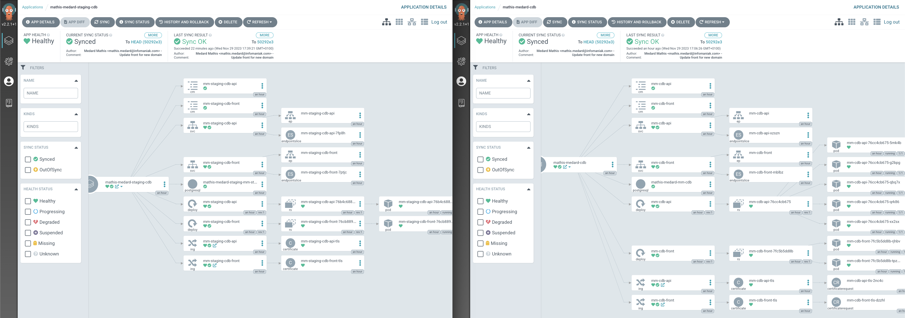

# Takima 03

## SOMMAIRE

- [TAKIMA 3](#takima-2)
    - [Somaire](#sommaire)
    - [La ressource Elasticsearch](#la-ressource-elasticsearch)
    - [Aller plus loin avec ELK](#aller-plus-loin-avec-elk)
        - [Scalez le Cluster ELK à 3 noeuds](#scalez-le-cluster-elk-à-3-noeuds)
        - [Retournez dans Kibana et relancer :](#retournez-dans-kibana-et-relancer-)
        - [Que constatez-vous ?](#que-constatez-vous-)
        - [Vérifiez que le Cluster fonctionne correctement.](#vérifiez-que-le-cluster-fonctionne-correctement)
    - [GitOps avec ArgoCD](#gitops-avec-argocd)
        - [Pour vérifier que tout fonctionne, essayez de détruire un deployment manuellement dans votre Cluster. Que se passe-t-il ?](#pour-vérifier-que-tout-fonctionne-essayez-de-détruire-un-deployment-manuellement-dans-votre-cluster-que-se-passe-t-il-)
        - [Essayez de modifier le values.yaml en augmentant le replicaCount par exemple. Que se passe-t-il ?](#essayez-de-modifier-le-valuesyaml-en-augmentant-le-replicacount-par-exemple-que-se-passe-t-il-)
  - [Bonus : un nouvel environnement](#bonus--un-nouvel-environnement)

## La ressource Elasticsearch

```bash
> GET _cat/health?v
epoch      timestamp cluster status node.total node.data shards pri relo init unassign pending_tasks max_task_wait_time active_shards_percent
1701246413 08:26:53  els     green           1         1     10  10    0    0        0             0                  -                100.0%
```

```bash
> GET _cat/allocation?v
shards disk.indices disk.used disk.avail disk.total disk.percent host       ip         node
    10       41.2mb    61.5mb    911.9mb    973.4mb            6 10.30.2.81 10.30.2.81 els-es-default-0
```

Le Kibana est bien connecté à Elasticsearch.

## Aller plus loin avec ELK

### Scalez le Cluster ELK à 3 noeuds

Éditez le CRD Elasticsearch et observez les nouveaux Pods elasticsearch se créer et s'initialiser un par un.

```yaml
...
spec:
  version: 7.16.0
  nodeSets:
    - name: default
      count: 1 ---> 3
...
```
Maintenant, on a 3 noeuds Elasticsearch et 10 shards.

### Retournez dans Kibana et relancer :

```bash
> GET _cat/health?v
epoch      timestamp cluster status node.total node.data shards pri relo init unassign pending_tasks max_task_wait_time active_shards_percent
1701247010 08:36:50  els     green           3         3     20  10    2    0        0             0                  -                100.0%
```

```bash
> GET _cat/allocation?v
shards disk.indices disk.used disk.avail disk.total disk.percent host        ip          node
     5        2.7mb    22.1mb    951.2mb    973.4mb            2 10.30.4.22  10.30.4.22  els-es-default-2
     7       43.7mb      61mb    912.3mb    973.4mb            6 10.30.7.130 10.30.7.130 els-es-default-1
     8       38.6mb    56.4mb      917mb    973.4mb            5 10.30.2.81  10.30.2.81  els-es-default-0
```

## Que constatez-vous ?

On a 3 noeuds Elasticsearch et 20 shards. (shard: une partie d'un index)


### Vérifiez que le Cluster fonctionne correctement.

```bash
 > PUT tp/_doc/1
   {
     "body": "hello"
   }
   
----------------------------------------

{
  "_index" : "tp",
  "_type" : "_doc",
  "_id" : "1",
  "_version" : 1,
  "result" : "created",
  "_shards" : {
    "total" : 2,
    "successful" : 1,
    "failed" : 0
  },
  "_seq_no" : 0,
  "_primary_term" : 1
}
```

On a bien créé un document dans l'index `tp`.

On peut le vérifier avec la commande suivante:

```bash
> GET tp/_doc/1

{
  "_index" : "tp",
  "_type" : "_doc",
  "_id" : "1",
  "_version" : 1,
  "_seq_no" : 0,
  "_primary_term" : 1,
  "found" : true,
  "_source" : {
    "body" : "hello"
  }
}
```

Le document est recupéré.

On peut verifier que l'index `tp` est bien créé avec la commande suivante:

```bash
> GET _cat/indices?v

health status index                           uuid                   pri rep docs.count docs.deleted store.size pri.store.size
green  open   .geoip_databases                XHrLNJkCRZqZuzjejfhTpg   1   1         41            0     76.6mb         38.3mb
green  open   .security-7                     b48vbNS2S5-AiAhnYq1R-Q   1   1         53            0    555.5kb        277.7kb
green  open   .apm-custom-link                a4MoCkJ9QVqb5ZphC9TDww   1   1          0            0       452b           226b
green  open   .kibana_task_manager_7.16.0_001 nPdFSKrcTJ-ZdamnC9RFSA   1   1         18          321    843.1kb        401.9kb
green  open   .apm-agent-configuration        IhhJMo_ES4-Uel2hy9EjXg   1   1          0            0       452b           226b
green  open   .kibana_7.16.0_001              Dd8eZ3x9Tt2t0jrk3TKz-w   1   1         32            8      9.4mb          4.7mb
green  open   <span style="color: red;">tp</span>                            Fzso3PxyQcOs59tFo8DDVQ   1   1          1            0      7.6kb          3.7kb
```

On a bien l'index `tp` dans la liste.

## GitOps avec ArgoCD

### Pour vérifier que tout fonctionne, essayez de détruire un deployment manuellement dans votre Cluster. Que se passe-t-il ?

```bash
➜ kube delete deployments.apps mm-cdb-front 
deployment.apps "mm-cdb-front" deleted

➜ kube get all                             
NAME                                READY   STATUS        RESTARTS        AGE
...
pod/mm-cdb-front-7fc5b5dd8b-5mpjq   1/1     Terminating   0               5m15s
pod/mm-cdb-front-7fc5b5dd8b-h5tcz   1/1     Terminating   0               5m15s
pod/mm-cdb-front-7fc5b5dd8b-v7kgs   1/1     Terminating   0               5m15s
pod/mm-cdb-front-7fc5b5dd8b-cjpwx   1/1     Running       0               6s
pod/mm-cdb-front-7fc5b5dd8b-czmvs   1/1     Running       0               6s
pod/mm-cdb-front-7fc5b5dd8b-zd9kh   1/1     Running       0               6s
...


NAME                           READY   UP-TO-DATE   AVAILABLE   AGE
...
deployment.apps/mm-cdb-front   3/3     3            3           6s


```

Le Deployment ainsi que les Pods sont bien recréé automatiquement grâce à ArgoCD.

### Essayez de modifier le values.yaml en augmentant le replicaCount par exemple. Que se passe-t-il ?

En modifiant le `replicaCount` dans le fichier `values.yaml` et en le poussant sur le repo Git, 
ArgoCD va automatiquement mettre à jour le Deployment.

## Bonus : un nouvel environnement

On définit les valeurs qui sont mofifiées dans un ficher values.staging.yaml.


