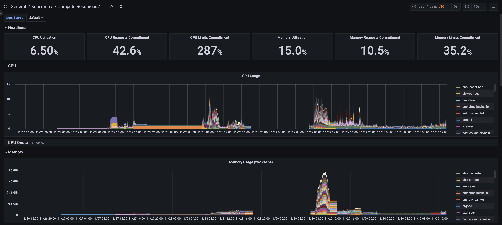
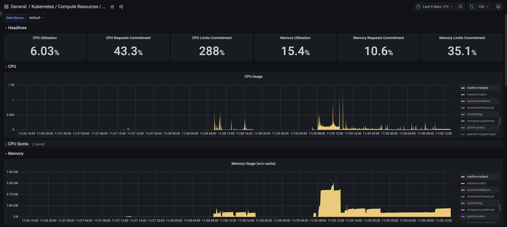
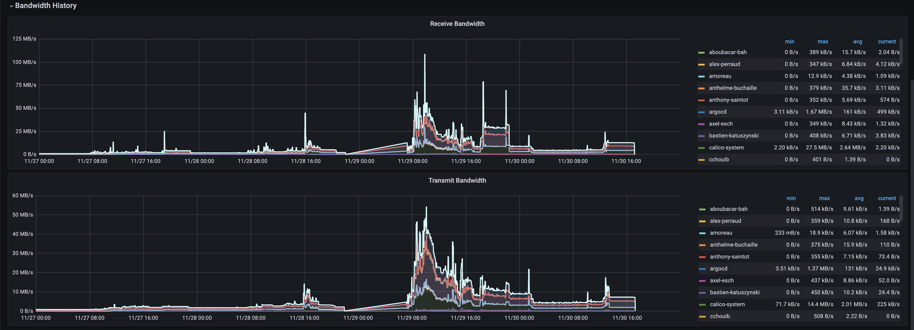
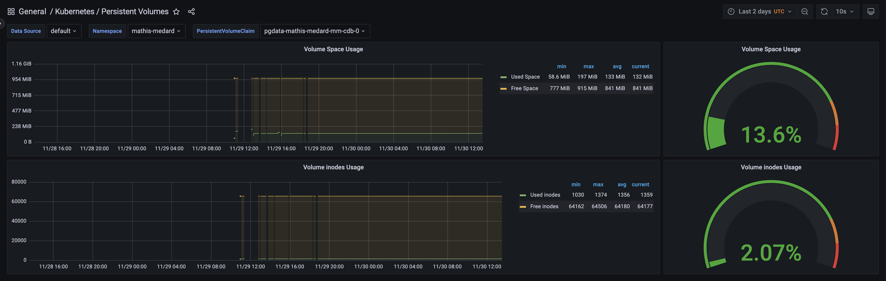

# Takima 4 - TP initiation monitoring

## SOMMAIRE

- [Takima 4](#takima-4---tp-initiation-monitoring)
  - [SOMMAIRE](#sommaire)
  - [Grafana et Prometheus](#grafana-et-prometheus)
    - [Quelle est le rôle de Prometheus ?](#quelle-est-le-rôle-de-prometheus-)
    - [Quelle est le rôle de Grafana ?](#quelle-est-le-rôle-de-grafana-)
  - [Notre dashboards](#notre-dashboards)
    - [Récupérez un état des lieux des ressources CPU et RAM utilisé ou requise au niveau du cluster Kubernetes entier](#récupérez-un-état-des-lieux-des-ressources-cpu-et-ram-utilisé-ou-requise-au-niveau-du-cluster-kubernetes-entier)
    - [Récupérez le graphe de la RAM utilisée sur votre propre namespace](#récupérez-le-graphe-de-la-ram-utilisée-sur-votre-propre-namespace)
    - [Récupérez un état des lieux de la bande passante utilisé au niveau du cluster Kubernetes entier](#récupérez-un-état-des-lieux-de-la-bande-passante-utilisé-au-niveau-du-cluster-kubernetes-entier)
    - [Récupérez le monitoring de l'espace utilisé par votre volume persistant de votre base de données](#récupérez-le-monitoring-de-lespace-utilisé-par-votre-volume-persistant-de-votre-base-de-données-ou-le-volume-primaire-dans-le-cas-ou-vous-utiliser-loperator-postgresql)

## Grafana et Prometheus

### Quelle est le rôle de Prometheus ?

Prometheus est un outil de monitoring et d'alerting. Il permet de récupérer des métriques sur les ressources de notre cluster Kubernetes. Il permet aussi de créer des alertes en cas de dépassement de seuil.

### Quelle est le rôle de Grafana ?

Grafana est un outil de visualisation de données. Il permet de créer des dashboards pour visualiser les métriques récupérées par Prometheus.

## Notre dashboards

### Récupérez un état des lieux des ressources CPU et RAM utilisé ou requise au niveau du cluster Kubernetes entier

On retrouve sur les deux graphes le nombre de CPU et la quantité de RAM utilisé par le cluster Kubernetes entier. (Tout namespace confondu)

### Récupérez le graphe de la RAM utilisée sur votre propre namespace

En selectionnant le namespace `mathis-medard` on retrouve le graphe des CPU et de la RAM utilisée par les pods de ce namespace.

### Récupérez un état des lieux de la bande passante utilisé au niveau du cluster Kubernetes entier

On retrouve sur le graphe la bande passante utilisé par le cluster Kubernetes entier. (Tout namespace confondu)

Le premier graphes représente la bande passante entrante et le second la bande passante sortante.

### Récupérez le monitoring de l'espace utilisé par votre volume persistant de votre base de données (ou le volume primaire dans le cas ou vous utiliser l'operator postgreSQL)

Pour le volume primaire de la base de données (pgdata-mathis-medard-mm-cdb-0) on retrouve le graphe de l'espace utilisé par le volume pour les 2 derniers jours (temps de vie).

Le premier graphe représente l'espace utilisé et libre par le namespace, le second représente l'espace inode (nœud d'index: structure de données contenant des informations à propos d'un fichier ou répertoire stocké dans certains systèmes de fichiers) utilisé et libre par le namespace.