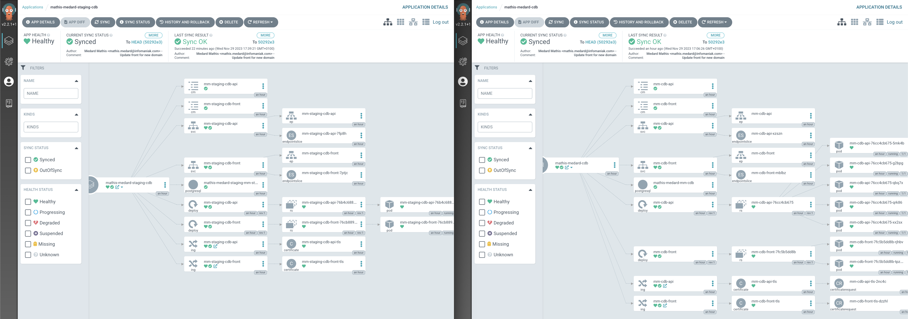
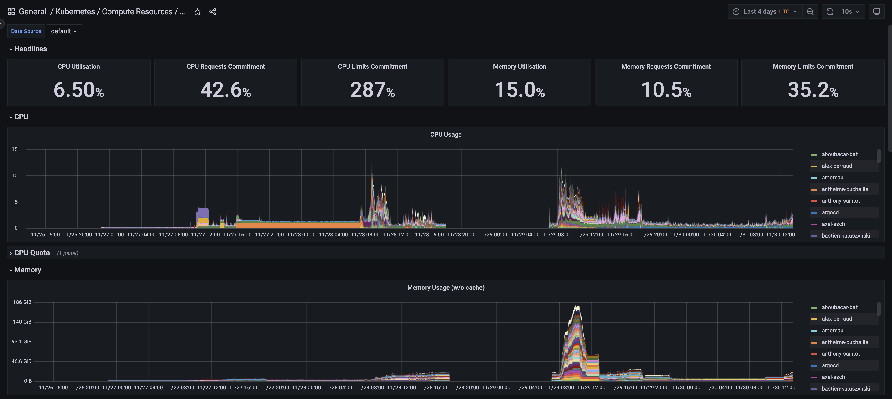
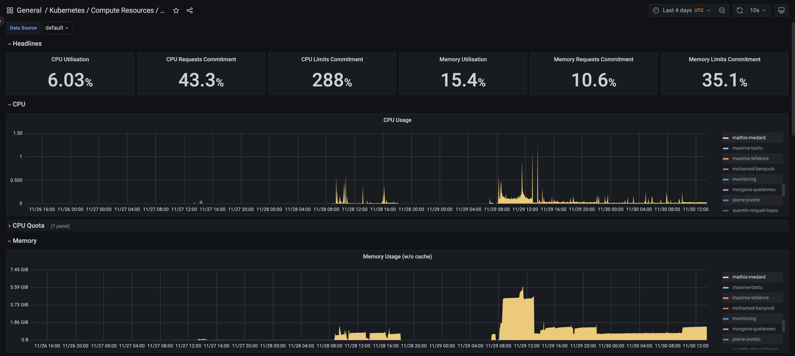
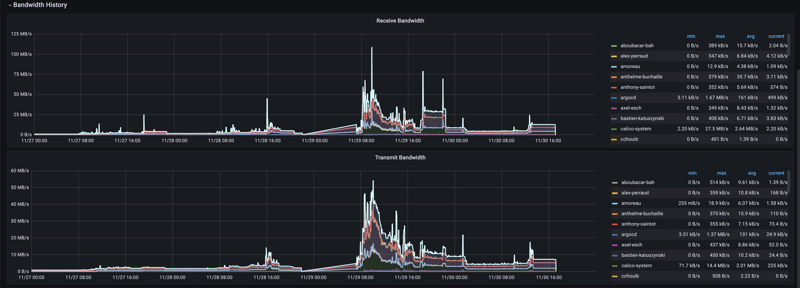
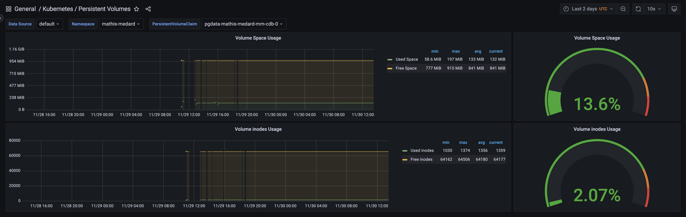

# TAKIMA 1

## Somaire

- [Jour 1](#takima-1)
    - [Somaire](#somaire)
    - [Kubeconfig](#Kubeconfig)
    - [Premières commandes](#premières-commandes)
  - [Etape 1 : Premières ressources : Pods/Replicaset/Deployment](#etape-1--premières-ressources--podsreplicasetdeployment)
      - [ReplicaSet](#ReplicaSet)
      - [Deployment](#Deployment)
      - [Faire un Rollback](#Faire-un-Rollback)
      - [Mettre à l'échelle](#mettre-à-léchelle)
      - [Mettre en standby un deploiement](#Mettre-en-standby-un-deploiement)
  - [Etape 2 : Publication Service/Ingress](#etape-2--publication-serviceingress)
  - [Etape 3 : ConfigMap/Secret](#etape-3--configmapsecret)
- [Jour 2](#takima-2)
    - [1ère étape : déployer l’API](#1ère-étape--déployer-lapi)
    - [2ᵉ étape : créer la base de données](#2ᵉ-étape--créer-la-base-de-données)
    - [3ᵉ étape : Faire pointer l’API sur la base de données](#3ᵉ-étape--faire-pointer-lapi-sur-la-base-de-données)
    - [4ᵉ étape : Rendre votre deployment parfait !](#4ᵉ-étape--rendre-votre-deployment-parfait-)
    - [5ᵉ étape : C'est au tour du Front.](#5ᵉ-étape--cest-au-tour-du-front)
    - [6ᵉ étape : La persistance dans Kubernetes](#6ᵉ-étape--la-persistance-dans-kubernetes)
- [Jour 3](#takima-3)
    - [La ressource Elasticsearch](#la-ressource-elasticsearch)
    - [Aller plus loin avec ELK](#aller-plus-loin-avec-elk)
        - [Scalez le Cluster ELK à 3 noeuds](#scalez-le-cluster-elk-à-3-noeuds)
        - [Retournez dans Kibana et relancer :](#retournez-dans-kibana-et-relancer-)
        - [Que constatez-vous ?](#que-constatez-vous-)
        - [Vérifiez que le Cluster fonctionne correctement.](#vérifiez-que-le-cluster-fonctionne-correctement)
    - [GitOps avec ArgoCD](#gitops-avec-argocd)
        - [Pour vérifier que tout fonctionne, essayez de détruire un deployment manuellement dans votre Cluster. Que se passe-t-il ?](#pour-vérifier-que-tout-fonctionne-essayez-de-détruire-un-deployment-manuellement-dans-votre-cluster-que-se-passe-t-il-)
        - [Essayez de modifier le values.yaml en augmentant le replicaCount par exemple. Que se passe-t-il ?](#essayez-de-modifier-le-valuesyaml-en-augmentant-le-replicacount-par-exemple-que-se-passe-t-il-)
    - [Bonus : un nouvel environnement](#bonus--un-nouvel-environnement)
- [Jour 4](#takima-4---tp-initiation-monitoring)
    - [Grafana et Prometheus](#grafana-et-prometheus)
        - [Quelle est le rôle de Prometheus ?](#quelle-est-le-rôle-de-prometheus-)
        - [Quelle est le rôle de Grafana ?](#quelle-est-le-rôle-de-grafana-)
    - [Notre dashboards](#notre-dashboards)
        - [Récupérez un état des lieux des ressources CPU et RAM utilisé ou requise au niveau du cluster Kubernetes entier](#récupérez-un-état-des-lieux-des-ressources-cpu-et-ram-utilisé-ou-requise-au-niveau-du-cluster-kubernetes-entier)
        - [Récupérez le graphe de la RAM utilisée sur votre propre namespace](#récupérez-le-graphe-de-la-ram-utilisée-sur-votre-propre-namespace)
        - [Récupérez un état des lieux de la bande passante utilisé au niveau du cluster Kubernetes entier](#récupérez-un-état-des-lieux-de-la-bande-passante-utilisé-au-niveau-du-cluster-kubernetes-entier)
        - [Récupérez le monitoring de l'espace utilisé par votre volume persistant de votre base de données](#récupérez-le-monitoring-de-lespace-utilisé-par-votre-volume-persistant-de-votre-base-de-données-ou-le-volume-primaire-dans-le-cas-ou-vous-utiliser-loperator-postgresql)

## Kubeconfig

### Quelles sont les informations que l'on retrouve dans ce fichier ?

Le fichier kubeconfig contient les informations de configuration de l'authentification et de l'accès au cluster Kubernetes. Il contient notamment les informations suivantes :

## Premières commandes

### Quelle est la différence ?
#### Entre `kubectl get pods -n votre_namespace` et `kubectl get pods -n default`

Il n'y a pas de différence car la configuration que l'on a donné à Kubernetes défini le namespace `votre_namespace` comme namespace par défaut.

## Etape 1 : Premières ressources : Pods/Replicaset/Deployment

### Quelles sont les propriétés principales que l'on retrouve ?

- apiVersion
- kind
- metadata
- spec

### Que se passe-t-il lors de cette deuxième création en imperatif ?

Lors du deuxième `kubectl run mynginx --image registry.takima.io/school/proxy/nginx` une erreur est levée car le pod `mynginx` existe déjà. En effet, le nom du pod doit être unique.

### Que se passe-t-il lors de cette deuxième création en déclaratif ?

```bash
❯ kubectl apply -f mynginx.yml

Warning: resource pods/mynginx is missing the kubectl.kubernetes.io/last-applied-configuration annotation which is required by kubectl apply. kubectl apply should only be used on resources created declaratively by either kubectl create --save-config or kubectl apply. The missing annotation will be patched automatically.
pod/mynginx configured
```

Lors du lancement en déclaratif, au lieu de recréer un Pod, Kubernetes met à jour le Pod existant.

## ReplicaSet

### Exemple

```yaml
apiVersion: apps/v1
kind: ReplicaSet
metadata:
  name: unicorn-front-replicaset
  labels:
    app: unicorn-front
spec:
  template:
    metadata:
      name: unicorn-front-pod
      labels:
        app: unicorn-front
    spec:
      containers:
      - name: unicorn-front
        image: registry.takima.io/school/proxy/nginx
  replicas: 3
  selector:
    matchLabels:
      app: unicorn-front
```

### Que remarquez-vous dans la description des properties `spec: template` ?

Le `spec: template` contient la description du pod qui sera créé par le ReplicaSet.

### À quoi sert le `selector: matchLabels` ?

Le `selector: matchLabels` permet de sélectionner les pods qui seront gérés par le ReplicaSet.
Ici, le ReplicaSet va gérer les pods qui ont le label `app: unicorn-front`.

### Combien y a-t'il de pods déployés dans votre namespace ?

```bash
❯ kubectl get pods -n mathis-medard

NAME                             READY   STATUS    RESTARTS   AGE
unicorn-front-replicaset-7bl5p   1/1     Running   0          89s
unicorn-front-replicaset-84rxq   1/1     Running   0          89s
unicorn-front-replicaset-r4z4q   1/1     Running   0          89s
```

Trois pods ont été déployés dans le namespace `mathis-medard`.

### Maintenant, supprimez un Pod. Que se passe-t'il ?

```bash
❯ kubectl delete pod unicorn-front-replicaset-7bl5p

pod "unicorn-front-replicaset-7bl5p" deleted

❯ kubectl get pods -n mathis-medard

NAME                             READY   STATUS    RESTARTS   AGE
unicorn-front-replicaset-84rxq   1/1     Running   0          3m34s
unicorn-front-replicaset-h294b   1/1     Running   0          4s
unicorn-front-replicaset-r4z4q   1/1     Running   0          3m34s
```

Le Pod a bien été supprimé et un nouveau Pod a été créé par le ReplicaSet pour le remplacer.

### Supprimez le ReplicaSet. Que se passe-t'il ?

```bash
❯ kubectl delete replicaset unicorn-front-replicaset
replicaset.apps "unicorn-front-replicaset" deleted

❯ kube get pods
No resources found in mathis-medard namespace.
```

Le ReplicaSet a été supprimé et les Pods qu'il gérait ont aussi été supprimés.

## Deployment

La ressource Deployment est très proche de celle d’un ReplicaSet :
```yaml
apiVersion: apps/v1
kind: Deployment
metadata:
  name: unicorn-front-deployment
  labels:
    app: unicorn-front
spec:
  replicas: 3
  selector:
    matchLabels:
      app: unicorn-front
  template:
    metadata:
      labels:
        app: unicorn-front
    spec:
      containers:
      - name: unicorn-front
        image: registry.takima.io/school/proxy/nginx:1.7.9
        ports:
        - containerPort: 80
```

### Quels sont les changements par rapport au ReplicaSet ?

Il n'y a pas de changement par rapport au ReplicaSet.
Le Deployment est une ressource de plus haut niveau qui permet de gérer les ReplicaSets.

### Déployez ce Deployment. Combien y a-t'il de ReplicaSet ? De Pods ?

```bash
❯ kubectl apply -f unicorn-front-deployment.yml
deployment.apps/unicorn-front-deployment created

❯ kube get pods                                                     
NAME                                       READY   STATUS    RESTARTS   AGE
unicorn-front-deployment-644bd5bb5-b4xfd   1/1     Running   0          9s
unicorn-front-deployment-644bd5bb5-kvvz7   1/1     Running   0          9s
unicorn-front-deployment-644bd5bb5-ldpjq   1/1     Running   0          9s
```

Il y a un seul ReplicaSet et trois Pods.

```bash
❯ kubectl get all
NAME                                           READY   STATUS    RESTARTS   AGE
pod/unicorn-front-deployment-644bd5bb5-b4xfd   1/1     Running   0          3m51s
pod/unicorn-front-deployment-644bd5bb5-kvvz7   1/1     Running   0          3m51s
pod/unicorn-front-deployment-644bd5bb5-ldpjq   1/1     Running   0          3m51s

NAME                                       READY   UP-TO-DATE   AVAILABLE   AGE
deployment.apps/unicorn-front-deployment   3/3     3            3           3m52s

NAME                                                 DESIRED   CURRENT   READY   AGE
replicaset.apps/unicorn-front-deployment-644bd5bb5   3         3         3       3m52s

```

### Une fois terminé, combien y a-t-il de replicaset ?

Il existe deux ReplicaSets. Mais le premier est orphelin car il ne gère plus aucun Pod.

### Combien y a-t-il de Pods ?

Il y a toujours trois Pods.

### Allez voir les logs des événements du déploiement avec `kubectl describe deployments. Qu’observez vous ?

```bash
❯ kubectl describe deployments
Name:                   unicorn-front-deployment
Namespace:              mathis-medard
CreationTimestamp:      Mon, 27 Nov 2023 11:25:46 +0100
Labels:                 app=unicorn-front
Annotations:            deployment.kubernetes.io/revision: 2
                        kubernetes.io/change-cause:
                          kubectl set image deployment/unicorn-front-deployment unicorn-front=registry.takima.io/school/proxy/nginx:1.9.1 --record=true
Selector:               app=unicorn-front
Replicas:               3 desired | 3 updated | 3 total | 3 available | 0 unavailable
StrategyType:           RollingUpdate
MinReadySeconds:        0
RollingUpdateStrategy:  25% max unavailable, 25% max surge
Pod Template:
  Labels:  app=unicorn-front
  Containers:
   unicorn-front:
    Image:        registry.takima.io/school/proxy/nginx:1.9.1
    Port:         80/TCP
    Host Port:    0/TCP
    Environment:  <none>
    Mounts:       <none>
  Volumes:        <none>
Conditions:
  Type           Status  Reason
  ----           ------  ------
  Available      True    MinimumReplicasAvailable
  Progressing    True    NewReplicaSetAvailable
OldReplicaSets:  unicorn-front-deployment-644bd5bb5 (0/0 replicas created)
NewReplicaSet:   unicorn-front-deployment-66f8d44ccf (3/3 replicas created)
Events:
  Type    Reason             Age    From                   Message
  ----    ------             ----   ----                   -------
  Normal  ScalingReplicaSet  11m    deployment-controller  Scaled up replica set unicorn-front-deployment-644bd5bb5 to 3
  Normal  ScalingReplicaSet  5m17s  deployment-controller  Scaled up replica set unicorn-front-deployment-66f8d44ccf to 1
  Normal  ScalingReplicaSet  5m15s  deployment-controller  Scaled down replica set unicorn-front-deployment-644bd5bb5 to 2
  Normal  ScalingReplicaSet  5m15s  deployment-controller  Scaled up replica set unicorn-front-deployment-66f8d44ccf to 2
  Normal  ScalingReplicaSet  5m13s  deployment-controller  Scaled down replica set unicorn-front-deployment-644bd5bb5 to 1
  Normal  ScalingReplicaSet  5m13s  deployment-controller  Scaled up replica set unicorn-front-deployment-66f8d44ccf to 3
  Normal  ScalingReplicaSet  5m11s  deployment-controller  Scaled down replica set unicorn-front-deployment-644bd5bb5 to 0
```

On observe que le déploiement a été mis à jour.
Le ReplicaSet `unicorn-front-deployment-644bd5bb5` a été vidé et le ReplicaSet `unicorn-front-deployment-66f8d44ccf` a été créé et rempli avec les nouveaux Pod.

## Faire un Rollback

Mettez à jour votre déploiement avec une nouvelle version de l’image nginx.

```bash
❯ kubectl set image deployment.v1.apps/unicorn-front-deployment unicorn-front=registry.takima.io/school/proxy/nginx:1.91-falseimage --record=true
```
Observez votre Deployment, vos Pods et vos ReplicaSets.

### Que se passe-t'il ? Pourquoi ?

```bash
❯ kubectl rollout status deployment.v1.apps/unicorn-front-deployment                                            
Waiting for deployment "unicorn-front-deployment" rollout to finish: 1 out of 3 new replicas have been updated...

❯ kubectl get all                                                                                                                                
NAME                                            READY   STATUS             RESTARTS   AGE
pod/unicorn-front-deployment-66f8d44ccf-5xnkg   1/1     Running            0          9m45s
pod/unicorn-front-deployment-66f8d44ccf-8vp55   1/1     Running            0          9m47s
pod/unicorn-front-deployment-66f8d44ccf-wxspl   1/1     Running            0          9m49s
pod/unicorn-front-deployment-6c4646748d-x6sv2   0/1     ImagePullBackOff   0          2m5s

NAME                                       READY   UP-TO-DATE   AVAILABLE   AGE
deployment.apps/unicorn-front-deployment   3/3     1            3           16m

NAME                                                  DESIRED   CURRENT   READY   AGE
replicaset.apps/unicorn-front-deployment-644bd5bb5    0         0         0       16m
replicaset.apps/unicorn-front-deployment-66f8d44ccf   3         3         3       9m49s
replicaset.apps/unicorn-front-deployment-6c4646748d   1         1         0       2m5s
```

Le nouveau ReplicaSet `unicorn-front-deployment-6c4646748d` a été créé mais les Pods ne sont pas prêts car l'image n'a pas pu être téléchargée.

#### Dans ce cas de figure, l'objectif est de revenir à une version stable de `Deployment`

Pour commencer, vérifiez les révisions de ce déploiement :

```bash
❯ kubectl rollout history deployment.v1.apps/unicorn-front-deployment

deployment.apps/unicorn-front-deployment 
REVISION  CHANGE-CAUSE
1         <none>
2         kubectl set image deployment/unicorn-front-deployment unicorn-front=registry.takima.io/school/proxy/nginx:1.9.1 --record=true
3         kubectl set image deployment.v1.apps/unicorn-front-deployment unicorn-front=registry.takima.io/school/proxy/nginx:1.91-falseimage --record=true
```

### Combien y a-t-il de révisions ? À quoi correspond le champ CHANGE-CAUSE ?

Il y a trois révisions. Le champ `CHANGE-CAUSE correspond à la commande qui a été exécutée pour mettre à jour le déploiement.

#### Pour revenir à la révision 2, vous pouvez utiliser la commande suivante :

```bash
❯ kubectl rollout undo deployment.v1.apps/unicorn-front-deployment --to-revision=2

deployment.apps/unicorn-front-deployment rolled back
```

## Mettre à l'échelle

Pour scaler le serveur nginx à 5:

```bash
❯ kubectl scale deployment.v1.apps/unicorn-front-deployment --replicas=5

deployment.apps/unicorn-front-deployment scaled
```

### Combien y a-t'il de Pods?

```bash
❯ kubectl get all                                                                 

NAME                                            READY   STATUS    RESTARTS   AGE
pod/unicorn-front-deployment-66f8d44ccf-5xnkg   1/1     Running   0          17m
pod/unicorn-front-deployment-66f8d44ccf-6hvc6   1/1     Running   0          97s
pod/unicorn-front-deployment-66f8d44ccf-8vp55   1/1     Running   0          17m
pod/unicorn-front-deployment-66f8d44ccf-rkgbb   1/1     Running   0          97s
pod/unicorn-front-deployment-66f8d44ccf-wxspl   1/1     Running   0          17m

NAME                                       READY   UP-TO-DATE   AVAILABLE   AGE
deployment.apps/unicorn-front-deployment   5/5     5            5           24m

NAME                                                  DESIRED   CURRENT   READY   AGE
replicaset.apps/unicorn-front-deployment-644bd5bb5    0         0         0       24m
replicaset.apps/unicorn-front-deployment-66f8d44ccf   5         5         5       17m
replicaset.apps/unicorn-front-deployment-6c4646748d   0         0         0       9m58s
```

Il y a cinq Pods maintenant.

## Mettre en standby un deploiement

Mettez en pause un Deployment :
```bash
❯ kubectl rollout pause deployment.v1.apps/unicorn-front-deployment
deployment.apps/unicorn-front-deployment paused

❯ kubectl set image deployment.v1.apps/unicorn-front-deployment unicorn-front=registry.takima.io/school/proxy/nginx:1.20.2
deployment.apps/unicorn-front-deployment image updated
```

### Que se passe-t-il au niveau ReplicaSet ?

```bash
❯ kubectl get all
NAME                                            READY   STATUS    RESTARTS   AGE
pod/unicorn-front-deployment-66f8d44ccf-5xnkg   1/1     Running   0          30m
pod/unicorn-front-deployment-66f8d44ccf-6hvc6   1/1     Running   0          14m
pod/unicorn-front-deployment-66f8d44ccf-8vp55   1/1     Running   0          30m
pod/unicorn-front-deployment-66f8d44ccf-rkgbb   1/1     Running   0          14m
pod/unicorn-front-deployment-66f8d44ccf-wxspl   1/1     Running   0          30m

NAME                                       READY   UP-TO-DATE   AVAILABLE   AGE
deployment.apps/unicorn-front-deployment   5/5     0            5           36m

NAME                                                  DESIRED   CURRENT   READY   AGE
replicaset.apps/unicorn-front-deployment-644bd5bb5    0         0         0       36m
replicaset.apps/unicorn-front-deployment-66f8d44ccf   5         5         5       30m
replicaset.apps/unicorn-front-deployment-6c4646748d   0         0         0       22m
```

Il ne se passe rien au niveau des ReplicaSets car ils sont en pause.

```bash
❯ kubectl rollout resume deployment.v1.apps/unicorn-front-deployment
```

### Que se passe-t-il au niveau ReplicaSet ?

```bash
❯ kubectl get all
NAME                                            READY   STATUS    RESTARTS   AGE
pod/unicorn-front-deployment-6d6c86587c-9f55w   1/1     Running   0          64s
pod/unicorn-front-deployment-6d6c86587c-ff556   1/1     Running   0          64s
pod/unicorn-front-deployment-6d6c86587c-g59dm   1/1     Running   0          64s
pod/unicorn-front-deployment-6d6c86587c-hmhns   1/1     Running   0          62s
pod/unicorn-front-deployment-6d6c86587c-t5ltp   1/1     Running   0          62s

NAME                                       READY   UP-TO-DATE   AVAILABLE   AGE
deployment.apps/unicorn-front-deployment   5/5     5            5           5m39s

NAME                                                  DESIRED   CURRENT   READY   AGE
replicaset.apps/unicorn-front-deployment-644bd5bb5    0         0         0       36m
replicaset.apps/unicorn-front-deployment-6c4646748d   0         0         0       30m
replicaset.apps/unicorn-front-deployment-66f8d44ccf   5         5         5       22m
```

## Etape 2 : Publication Service/Ingress

### Mise en situation

### Que se passe-t'il ? Pourquoi ?

```bash
❯ kube get all                                  
NAME                                             READY   STATUS         RESTARTS   AGE
pod/simple-website-deployment-5566cdf4b8-hrfjr   0/1     ErrImagePull   0          4s
pod/simple-website-deployment-5566cdf4b8-lr4v2   0/1     ErrImagePull   0          4s
pod/simple-website-deployment-5566cdf4b8-pssbm   0/1     ErrImagePull   0          4s

NAME                                        READY   UP-TO-DATE   AVAILABLE   AGE
deployment.apps/simple-website-deployment   0/3     3            0           4s

NAME                                                   DESIRED   CURRENT   READY   AGE
replicaset.apps/simple-website-deployment-5566cdf4b8   3         3         0       4s
```

Les Pods ne sont pas prêts car l'image n'a pas pu être téléchargée.

### Décrivez ce que répond la Web App ? Actualisez votre page avec CTRL + F5. Que se passe-t-il ?

La Web App répond une page HTML avec un fond de couleur et le texte :
```
Je suis le Taki-Pod
situé sur le noeud

avec l'IP
```

En actualisant la page, la couleur du fond change

Maintenant, nous allons ajouter des configs de variables d'environement.

### Que constatez-vous sur le navigateur ?

Maintenant, en plus de la couleur de fond, nous avons le texte
```
Je suis le Taki-Pod simple-website-deployment-794f8d4c95-wf5w5
situé sur le noeud ip-10-30-7-190.eu-west-3.compute.internal

avec l'IP 10.30.7.70
```

Et en actualisant la page, nous changeons de Pod, de Noeud et d'IP

## Etape 3 : ConfigMap/Secret

Pour chaque ConfigMap ou Secret on créé le fichier correspondant avec nos variables dans la balise data.

Les secret doivent être encodés en base64 et les ConfigMap peuvent être en clair.

Ensuite on les ajoute dans le fichier de déploiement de cette manière:

```yaml
env:
# ------- Config Map -------
- name: USER
  valueFrom:
    configMapKeyRef:
      key: username
      name: simple-website-secret
      

# ------- Secret -------
- name: PASSWORD
  valueFrom:
    secretKeyRef:
      key: password
      name: simple-website-secret
```

# TAKIMA 2

## 1ère étape : déployer l’API

### Que se passe-t-il au niveau des Pods de l’API ? Vous pouvez jeter un oeil aux logs. (kubectl logs -f nomdupod)

```bash
► kube get all                    
        
NAME                                  READY   STATUS             RESTARTS      AGE
pod/api-deployment-58879987f4-5h5d2   0/1     CrashLoopBackOff   5 (21s ago)   3m37s
pod/api-deployment-58879987f4-l7kpl   0/1     CrashLoopBackOff   5 (24s ago)   3m37s
pod/api-deployment-58879987f4-xl465   0/1     CrashLoopBackOff   5 (21s ago)   3m37s

NAME                  TYPE        CLUSTER-IP      EXTERNAL-IP   PORT(S)   AGE
service/api-service   ClusterIP   172.20.55.206   <none>        80/TCP    3m22s

NAME                             READY   UP-TO-DATE   AVAILABLE   AGE
deployment.apps/api-deployment   0/3     3            0           3m37s

NAME                                        DESIRED   CURRENT   READY   AGE
replicaset.apps/api-deployment-58879987f4   3         3         0       3m37s
```

```bash
➜ kubectl logs -f pods/api-deployment-58879987f4-5h5d2 
Unknown argument: db.mathis-medard.takima.school
```

Les Pods de l'API ne peuvent pas se connecter à la base de données et ils crashent.

## 2ᵉ étape : créer la base de données

## 3ᵉ étape : Faire pointer l’API sur la base de données

### Quel est le nom du service de la base de données ?

```bash
➜ kubectl get services
NAME          TYPE        CLUSTER-IP      EXTERNAL-IP   PORT(S)    AGE
api-service   ClusterIP   172.20.55.206   <none>        80/TCP     39m
db-service    ClusterIP   172.20.7.20     <none>        5432/TCP   24m
```

Le service de la base de données est `db-service`

## 4ᵉ étape : Rendre votre deployment parfait !

## 5ᵉ étape : C'est au tour du Front.

### Pourquoi le computer a disparu ?

Il n'y a plus de computer car la base de données a été recréée et donc les données ont été perdues.
Il n'y a pas de volumes persistants.

### Vérifiez que le PVC est créé avec le PV. Quel est le nom du PV ?

```bash
➜ kubectl get pv

NAME                                       CAPACITY   ACCESS MODES   RECLAIM POLICY   STATUS   CLAIM                STORAGECLASS   REASON   AGE
pvc-b6b2e04f-cc42-4f60-a9ec-ef896a9e7712   3Gi        RWO            Delete           Bound    mathis-medard/db-pvc gp2                     6m21s
```

Le nom du PV est `pvc-b6b2e04f-cc42-4f60-a9ec-ef896a9e7712`

## 6ᵉ étape : La persistance dans Kubernetes

Pour la persistance dans Kubernetes, il faut créer des ressources de type `PersistentVolume` et `PersistentVolumeClaim`.

Le `Persistant Volume` correspond à la ressource de stockage physique et utilise un `StorageClass` pour définir le type de stockage.

Le `Persistent Volume Claim` permet de faire une demande de lecture/écriture sur un `Persistent Volume` en fonction de la configuration.


## Bonus: CronJob

```bash
➜ kube logs pods/logical-backup-formation-cdb-manual-zsbzq-mathis-medard-672wl
  % Total    % Received % Xferd  Average Speed   Time    Time     Time  Current
                                 Dload  Upload   Total   Spent    Left  Speed
100 17835    0 17835    0     0  17182      0 --:--:--  0:00:01 --:--:-- 17182
  % Total    % Received % Xferd  Average Speed   Time    Time     Time  Current
                                 Dload  Upload   Total   Spent    Left  Speed
100 19642    0 19642    0     0  1475k      0 --:--:-- --:--:-- --:--:-- 1475k
+ dump
+ /usr/lib/postgresql/14/bin/pg_dumpall
+ compress
+ pigz
+ upload
+ case $LOGICAL_BACKUP_PROVIDER in
++ estimate_size
++ /usr/lib/postgresql/14/bin/psql -tqAc 'select sum(pg_database_size(datname)::numeric) from pg_database;'
+ aws_upload 7148808
+ declare -r EXPECTED_SIZE=7148808
++ date +%s
+ PATH_TO_BACKUP=s3://backup-pg-formation/spilo/formation-cdb/118b4050-9d2a-4057-bff7-fd39feb9fbca/logical_backups/1701188914.sql.gz
+ args=()
+ [[ ! -z 7148808 ]]
+ args+=("--expected-size=$EXPECTED_SIZE")
+ [[ ! -z '' ]]
+ [[ ! -z eu-west-3 ]]
+ args+=("--region=$LOGICAL_BACKUP_S3_REGION")
+ [[ ! -z AES256 ]]
+ args+=("--sse=$LOGICAL_BACKUP_S3_SSE")
+ aws s3 cp - s3://backup-pg-formation/spilo/formation-cdb/118b4050-9d2a-4057-bff7-fd39feb9fbca/logical_backups/1701188914.sql.gz --expected-size=7148808 --region=eu-west-3 --sse=AES256
+ [[ 0 != 0 ]]
+ [[ 0 != 0 ]]
+ [[ 0 != 0 ]]
+ set +x
```

# Takima 3

## La ressource Elasticsearch

```bash
> GET _cat/health?v
epoch      timestamp cluster status node.total node.data shards pri relo init unassign pending_tasks max_task_wait_time active_shards_percent
1701246413 08:26:53  els     green           1         1     10  10    0    0        0             0                  -                100.0%
```

```bash
> GET _cat/allocation?v
shards disk.indices disk.used disk.avail disk.total disk.percent host       ip         node
    10       41.2mb    61.5mb    911.9mb    973.4mb            6 10.30.2.81 10.30.2.81 els-es-default-0
```

Le Kibana est bien connecté à Elasticsearch.

## Aller plus loin avec ELK

### Scalez le Cluster ELK à 3 noeuds

Éditez le CRD Elasticsearch et observez les nouveaux Pods elasticsearch se créer et s'initialiser un par un.

```yaml
...
spec:
  version: 7.16.0
  nodeSets:
    - name: default
      count: 1 ---> 3
...
```
Maintenant, on a 3 noeuds Elasticsearch et 10 shards.

### Retournez dans Kibana et relancer :

```bash
> GET _cat/health?v
epoch      timestamp cluster status node.total node.data shards pri relo init unassign pending_tasks max_task_wait_time active_shards_percent
1701247010 08:36:50  els     green           3         3     20  10    2    0        0             0                  -                100.0%
```

```bash
> GET _cat/allocation?v
shards disk.indices disk.used disk.avail disk.total disk.percent host        ip          node
     5        2.7mb    22.1mb    951.2mb    973.4mb            2 10.30.4.22  10.30.4.22  els-es-default-2
     7       43.7mb      61mb    912.3mb    973.4mb            6 10.30.7.130 10.30.7.130 els-es-default-1
     8       38.6mb    56.4mb      917mb    973.4mb            5 10.30.2.81  10.30.2.81  els-es-default-0
```

## Que constatez-vous ?

On a 3 noeuds Elasticsearch et 20 shards. (shard: une partie d'un index)


### Vérifiez que le Cluster fonctionne correctement.

```bash
 > PUT tp/_doc/1
   {
     "body": "hello"
   }
   
----------------------------------------

{
  "_index" : "tp",
  "_type" : "_doc",
  "_id" : "1",
  "_version" : 1,
  "result" : "created",
  "_shards" : {
    "total" : 2,
    "successful" : 1,
    "failed" : 0
  },
  "_seq_no" : 0,
  "_primary_term" : 1
}
```

On a bien créé un document dans l'index `tp`.

On peut le vérifier avec la commande suivante:

```bash
> GET tp/_doc/1

{
  "_index" : "tp",
  "_type" : "_doc",
  "_id" : "1",
  "_version" : 1,
  "_seq_no" : 0,
  "_primary_term" : 1,
  "found" : true,
  "_source" : {
    "body" : "hello"
  }
}
```

Le document est recupéré.

On peut verifier que l'index `tp` est bien créé avec la commande suivante:

```bash
> GET _cat/indices?v

health status index                           uuid                   pri rep docs.count docs.deleted store.size pri.store.size
green  open   .geoip_databases                XHrLNJkCRZqZuzjejfhTpg   1   1         41            0     76.6mb         38.3mb
green  open   .security-7                     b48vbNS2S5-AiAhnYq1R-Q   1   1         53            0    555.5kb        277.7kb
green  open   .apm-custom-link                a4MoCkJ9QVqb5ZphC9TDww   1   1          0            0       452b           226b
green  open   .kibana_task_manager_7.16.0_001 nPdFSKrcTJ-ZdamnC9RFSA   1   1         18          321    843.1kb        401.9kb
green  open   .apm-agent-configuration        IhhJMo_ES4-Uel2hy9EjXg   1   1          0            0       452b           226b
green  open   .kibana_7.16.0_001              Dd8eZ3x9Tt2t0jrk3TKz-w   1   1         32            8      9.4mb          4.7mb
green  open   <span style="color: red;">tp</span>                            Fzso3PxyQcOs59tFo8DDVQ   1   1          1            0      7.6kb          3.7kb
```

On a bien l'index `tp` dans la liste.

## GitOps avec ArgoCD

### Pour vérifier que tout fonctionne, essayez de détruire un deployment manuellement dans votre Cluster. Que se passe-t-il ?

```bash
➜ kube delete deployments.apps mm-cdb-front 
deployment.apps "mm-cdb-front" deleted

➜ kube get all                             
NAME                                READY   STATUS        RESTARTS        AGE
...
pod/mm-cdb-front-7fc5b5dd8b-5mpjq   1/1     Terminating   0               5m15s
pod/mm-cdb-front-7fc5b5dd8b-h5tcz   1/1     Terminating   0               5m15s
pod/mm-cdb-front-7fc5b5dd8b-v7kgs   1/1     Terminating   0               5m15s
pod/mm-cdb-front-7fc5b5dd8b-cjpwx   1/1     Running       0               6s
pod/mm-cdb-front-7fc5b5dd8b-czmvs   1/1     Running       0               6s
pod/mm-cdb-front-7fc5b5dd8b-zd9kh   1/1     Running       0               6s
...


NAME                           READY   UP-TO-DATE   AVAILABLE   AGE
...
deployment.apps/mm-cdb-front   3/3     3            3           6s


```

Le Deployment ainsi que les Pods sont bien recréé automatiquement grâce à ArgoCD.

### Essayez de modifier le values.yaml en augmentant le replicaCount par exemple. Que se passe-t-il ?

En modifiant le `replicaCount` dans le fichier `values.yaml` et en le poussant sur le repo Git,
ArgoCD va automatiquement mettre à jour le Deployment.

## Bonus : un nouvel environnement

On définit les valeurs qui sont mofifiées dans un ficher values.staging.yaml.



Pour la configuration de l'environnement staging, on utilise le fichier `values.staging.yaml`, celui-ci utilise des application avec le nom finissant par `-staging` et utilise qu'un seul replica des pods pour limiter la consomation de mémoire et CPU.

# Takima 4 - TP initiation monitoring

## Grafana et Prometheus

### Quelle est le rôle de Prometheus ?

Prometheus est un outil de monitoring et d'alerting. Il permet de récupérer des métriques sur les ressources de notre cluster Kubernetes. Il permet aussi de créer des alertes en cas de dépassement de seuil.

### Quelle est le rôle de Grafana ?

Grafana est un outil de visualisation de données. Il permet de créer des dashboards pour visualiser les métriques récupérées par Prometheus.

## Notre dashboards

### Récupérez un état des lieux des ressources CPU et RAM utilisé ou requise au niveau du cluster Kubernetes entier


On retrouve sur les deux graphes le nombre de CPU et la quantité de RAM utilisé par le cluster Kubernetes entier. (Tout namespace confondu)

### Récupérez le graphe de la RAM utilisée sur votre propre namespace


En selectionnant le namespace `mathis-medard` on retrouve le graphe des CPU et de la RAM utilisée par les pods de ce namespace.

### Récupérez un état des lieux de la bande passante utilisé au niveau du cluster Kubernetes entier



On retrouve sur le graphe la bande passante utilisé par le cluster Kubernetes entier. (Tout namespace confondu)

Le premier graphes représente la bande passante entrante et le second la bande passante sortante.


### Récupérez le monitoring de l'espace utilisé par votre volume persistant de votre base de données (ou le volume primaire dans le cas ou vous utiliser l'operator postgreSQL)



Pour le volume primaire de la base de données (pgdata-mathis-medard-mm-cdb-0) on retrouve le graphe de l'espace utilisé par le volume pour les 2 derniers jours (temps de vie).

Le premier graphe représente l'espace utilisé et libre par le namespace, le second représente l'espace inode (nœud d'index: structure de données contenant des informations à propos d'un fichier ou répertoire stocké dans certains systèmes de fichiers) utilisé et libre par le namespace.